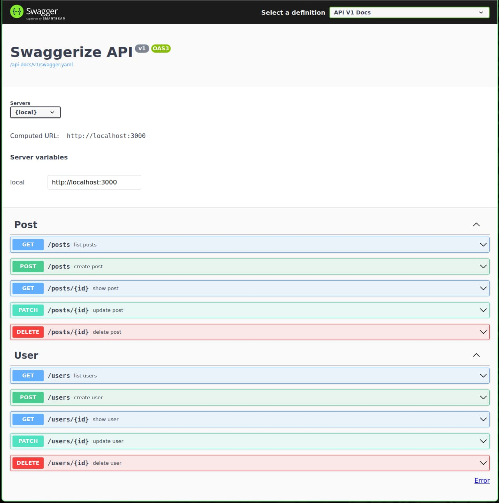

<div align = "center">

<h1><a href="https://github.com/2kabhishek/swaggerize">swaggerize</a></h1>

<a href="https://github.com/2KAbhishek/swaggerize/blob/main/LICENSE">
 </a>

<a href="https://github.com/2KAbhishek/swaggerize/graphs/contributors">
 </a>

<a href="https://github.com/2KAbhishek/swaggerize/stargazers">
</a>

<a href="https://github.com/2KAbhishek/swaggerize/network/members">
 </a>

<a href="https://github.com/2KAbhishek/swaggerize/watchers">
 </a>

<a href="https://github.com/2KAbhishek/swaggerize/pulse">
 </a>

<h3>Swagger and Rails 🤝💎</h3>

<figure>
  
  <br/>
  <figcaption>swaggerize in action</figcaption>
</figure>

</div>

swaggerize is a rails API application to demonstrate swagger integration with rails using rswag gem.

## ✨ Features

- Rails API app with interactive API docs
- Seeds with FactoryBot

## Setup

### ⚡ Requirements

- ruby 3.1.2

### 🚀 Installation

```bash
git clone https://github.com/2kabhishek/swaggerize
cd swaggerize
bundle install
bin/rake db:reset
```

### 💻 Usage

```bash
bin/rails s
```

##  Behind The Code

### 🌈 Inspiration

Was learning about swagger and wanted to try integration with rails

### 💡 Challenges/Learnings

- The main challenges were setting up `rswag`
- I learned about OpenAPI specs, swagger and the tooling around swagger.

### 🧰 Tooling

- [rswag](https://github.com/rswag/rswag) — Gem for Swagger integration
- [Dotfiles](https://github.com/2kabhishek/Dotfiles) — Dev Environment
- [nvim2k](https://github.com/2kabhishek/nvim2k) — Personalized Editor
- [awesome2k](https://github.com/2kabhishek/awesome2k) — Tiling Window Manager

<hr>

<div align="center">

<strong>⭐ hit the star button if you found this useful ⭐</strong><br>

<a href="https://github.com/2KAbhishek/swaggerize">Source</a>
| <a href="https://2kabhishek.github.io/blog" target="_blank">Blog </a>
| <a href="https://twitter.com/2kabhishek" target="_blank">Twitter </a>
| <a href="https://linkedin.com/in/2kabhishek" target="_blank">LinkedIn </a>
| <a href="https://2kabhishek.github.io/links" target="_blank">More Links </a>
| <a href="https://2kabhishek.github.io/projects" target="_blank">Other Projects </a>

</div>

